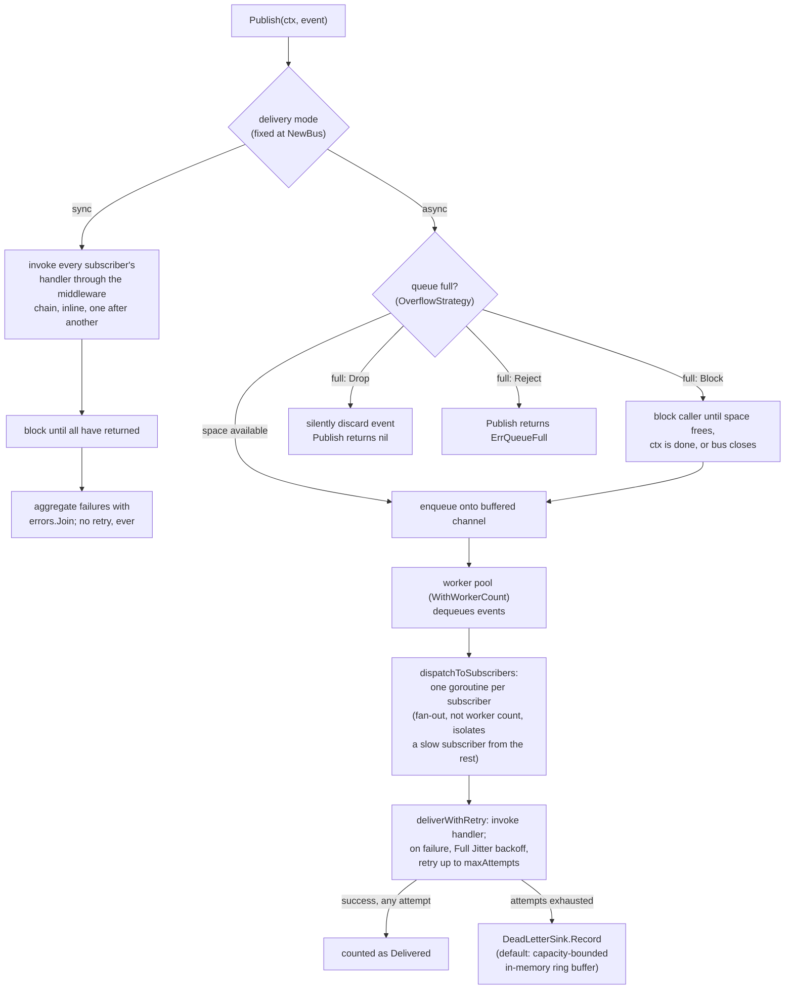

# 🎉 grevents - Lightweight In-Process Event Bus for Go

[](https://pkg.go.dev/github.com/gourdian25/grevents)
[](https://go.dev/)
[](LICENSE)

A lightweight, pluggable, **in-process** event bus for the gourdian ecosystem. It decouples producers of state changes (e.g. `grauth` assigning a role) from consumers that react to them (`graudit` recording it, `grcache` invalidating a related tag, a future notification system emailing someone) — without the producer needing to know any consumer exists.

grevents is explicitly **not** an attempt to replace Kafka, NATS, or RabbitMQ. It runs entirely within a single process's memory — see [Delivery Guarantees](#-delivery-guarantees) before assuming more than that.

## 🌐 Part of the gourdian25 ecosystem

grevents is one of several small, independent Go libraries meant to be used
together:

- [gourdiantoken](https://github.com/gourdian25/gourdiantoken) — JWT
  access/refresh token issuance, verification, revocation, and rotation.
- [grlog](https://github.com/gourdian25/grlog) — zero-dependency structured
  logging; grevents' optional `Logger` interface is satisfied by it directly.
- [grcache](https://github.com/gourdian25/grcache) — backend-agnostic
  caching abstraction; its own roadmap names grevents as the likely base
  for a future distributed-invalidation pub/sub, not yet wired up.
- [graudit](https://github.com/gourdian25/graudit) — an append-only,
  tamper-evident audit log; publishes an `"audit.recorded"` event through
  grevents on every successful write.
- [grpolicy](https://github.com/gourdian25/grpolicy) — attribute-based
  policy evaluation (RBAC/ABAC), independent of any notion of "user" or
  "role".
- [grnoti](https://github.com/gourdian25/grnoti) — a push-notification
  service (FCM dispatch, idempotent event processing, device-token
  management, dead-letter retry, circuit breaking, distributed rate
  limiting, deterministic A/B experiment assignment, localization,
  topic-based routing). Its `NotificationService` (`ServiceDeps.EventBus`)
  and its deterministic/cache-backed experiment engines each accept a
  `grevents.Bus` and publish `notification.sent`/`notification.failed`/
  `experiment.assigned` lifecycle events through it — always best-effort,
  so a nil bus or a publish failure never affects the durable operation it
  follows.

## 🌟 Why grevents?

- 🔌 **Pluggable delivery** — synchronous (blocks until every subscriber has run) or asynchronous (a worker pool delivers in the background), chosen once at construction
- 🔁 **Retry with backoff** — Full Jitter exponential backoff for async subscribers, independently per subscriber, so one flaky consumer never blocks another
- 💀 **Dead-letter handling** — an event that exhausts its retries lands in an inspectable `DeadLetterSink` instead of vanishing
- 🛡️ **Panic-safe by default** — a panic in a handler, middleware, `Logger`, or `DeadLetterSink` is always recovered; none of grevents' user-pluggable extension points can crash the bus or the host process, and this is not optional
- 🧵 **Honest shutdown** — `Close` drains within a configurable timeout and tells you exactly how many events it couldn't finish, rather than pretending everything always completes
- 📊 **Built-in stats** — published/delivered/failed/dead-lettered counters and queue depth via `Stats()`
- 🪵 **`log/slog`-shaped `Logger`** — any `*slog.Logger`, including one backed by grlog via `slog.New(grlog.NewSlogHandler(...))`, satisfies grevents' `Logger` interface with no adapter code

## 📚 Table of Contents

- [Installation](#-installation)
- [Quick Start](#-quick-start)
- [Core Concepts](#-core-concepts)
- [Architecture](#-architecture)
- [Delivery Modes](#-delivery-modes)
- [Overflow Strategies](#-overflow-strategies)
- [Retry and Dead Letters](#-retry-and-dead-letters)
- [Middleware](#-middleware)
- [Delivery Guarantees](#-delivery-guarantees)
- [Testing](#-testing)
- [Benchmarks](#-benchmarks)
- [Releasing](#-releasing)
- [Contributing](#-contributing)

## 📦 Installation

```bash
go get github.com/gourdian25/grevents
```

Requires Go 1.26.4+ (ecosystem-aligned minimum; only 1.24+ is functionally needed).

## 🚀 Quick Start

```go
package main

import (
	"context"
	"log"

	"github.com/gourdian25/grevents"
)

func main() {
	bus, err := grevents.NewBus() // synchronous delivery by default
	if err != nil {
		log.Fatal(err)
	}
	defer bus.Close()

	unsubscribe, err := bus.Subscribe("role.assigned", func(ctx context.Context, event grevents.Event) error {
		log.Printf("role assigned: %v", event.Payload)
		return nil
	})
	if err != nil {
		log.Fatal(err)
	}
	defer unsubscribe()

	err = bus.Publish(context.Background(), grevents.Event{
		Topic:   "role.assigned",
		Payload: "user:42 -> admin",
	})
	if err != nil {
		log.Fatal(err)
	}
}
```

See [`example/example.go`](example/example.go) for a complete runnable walkthrough of every feature, including `grlog` integration — run it with `go run ./example`.

## 🧩 Core Concepts

- **`Bus`** — the entry point: `Publish`, `Subscribe`, `Use`, `Stats`, `Close`.
- **`Event`** — `Topic` (matched by exact string equality — no wildcards in v1), `Payload` (opaque `any`), `Timestamp` (defaulted to now), `Metadata` (a `map[string]string` middleware can read/write).
- **`HandlerFunc`** — `func(ctx context.Context, event Event) error`, what a subscriber supplies to `Subscribe`.
- **`Middleware`** — `func(next HandlerFunc) HandlerFunc`, applied via `Use` in the order added; panic recovery wraps the *entire* chain unconditionally, so middleware never needs to recover its own panics.

## 🏗️ Architecture

Delivery mode is fixed once, at `NewBus` construction time (`sync.go` vs `async.go`), never chosen per `Publish` call:



Two things worth calling out that the diagram can't fully convey:

- **Worker count controls dequeue parallelism, not delivery concurrency.** However many workers pull events off the queue, every `(event, subscriber)` pair gets its *own* goroutine in `dispatchToSubscribers` — that fan-out, not `WithWorkerCount`, is what stops one flaky subscriber's retries from blocking delivery to another subscriber or to the next queued event.
- **Every handler invocation — sync or async — funnels through `invokeHandler`**, which wraps the whole middleware chain (not just the terminal handler) in panic recovery. A panic in a handler, in user middleware, in the `Logger`, or in the `DeadLetterSink` is always recovered; this is unconditional and cannot be turned off.

## 🔀 Delivery Modes

Delivery mode is fixed at construction time, not chosen per `Publish` call.

**Sync (`WithSync`, the default):**

```go
bus, _ := grevents.NewBus(grevents.WithSync())
```

`Publish` invokes every subscriber's handler and blocks until all have returned. Failures from multiple subscribers are aggregated with `errors.Join` — inspect with `errors.Is`/`errors.As`. There is no retry in sync mode: retrying would mean `Publish` blocks the caller for the full backoff duration, a footgun for anything called from a request path.

**Async (`WithAsync`):**

```go
bus, _ := grevents.NewBus(
	grevents.WithAsync(256, grevents.OverflowBlock),
	grevents.WithWorkerCount(4),
)
```

`Publish` enqueues and returns immediately (unless the queue is full — see below). A worker pool dequeues events and fans each one out to an independent goroutine per subscriber, so one slow or failing subscriber's retries never block delivery to another subscriber of the same event, nor delivery of the next queued event. `WithWorkerCount` controls dequeue parallelism only, not per-subscriber delivery concurrency.

## 🚦 Overflow Strategies

Chosen via the second argument to `WithAsync`:

| Strategy | Behavior when the queue is full |
|---|---|
| `OverflowBlock` | Blocks `Publish`'s caller until space frees, the bus closes (`ErrClosed`), or `ctx` is done (`ctx.Err()`) |
| `OverflowDrop` | Never blocks; silently discards the incoming event, `Publish` returns `nil` |
| `OverflowReject` | Never blocks; `Publish` returns `ErrQueueFull` immediately |

There is no drop-oldest strategy — evicting a live buffered channel's existing head isn't something Go's channel primitive supports without a different (more complex) queue structure, and no sibling library in this ecosystem has needed it.

## 🔁 Retry and Dead Letters

```go
dlq := grevents.NewMemoryDeadLetterSink(1000)
bus, _ := grevents.NewBus(
	grevents.WithAsync(256, grevents.OverflowBlock),
	grevents.WithRetry(5, 100*time.Millisecond),
	grevents.WithDeadLetterSink(dlq),
)
```

`WithRetry(maxAttempts, baseBackoff)` retries a failed async handler with Full Jitter exponential backoff (`sleep = random(0, min(cap, base*2^attempt))`), capped at a fixed internal ceiling. Once `maxAttempts` is exhausted, the `(event, subscriber)` pair is handed to the configured `DeadLetterSink` — the default in-memory implementation is a capacity-bounded ring buffer: a best-effort recent-history buffer, explicitly **not** a durable audit log.

```go
entries, _ := dlq.List(context.Background(), 0) // 0 = all entries, oldest first
for _, e := range entries {
	fmt.Printf("topic=%s attempts=%d lastErr=%s\n", e.Event.Topic, e.Attempts, e.LastError)
}
```

## 🧵 Middleware

```go
bus.Use(grevents.LoggingMiddleware(logger)) // logs each delivery attempt's outcome
bus.Use(grevents.TracingMiddleware())       // stub extension point for future tracing
bus.Use(func(next grevents.HandlerFunc) grevents.HandlerFunc {
	return func(ctx context.Context, event grevents.Event) error {
		// your own cross-cutting logic
		return next(ctx, event)
	}
})
```

Middleware is snapshotted at *delivery* time, not `Subscribe` time — a `Use` call taking effect concurrently with an in-flight `Publish` has undefined ordering relative to that specific call, but is guaranteed to apply to every delivery that reads the chain afterward.

### grlog interoperability

```go
import (
    "log/slog"

    "github.com/gourdian25/grlog"
)

logger := slog.New(grlog.NewSlogHandler(grlog.NewDefaultLogger()))
bus, _ := grevents.NewBus(grevents.WithLogger(logger))
```

`Logger`'s `Debug`/`Info`/`Warn`/`Error(msg string, args ...any)` methods match `*slog.Logger`'s own signatures exactly, so `*slog.Logger` — including one backed by grlog via `slog.New(grlog.NewSlogHandler(...))` — satisfies grevents' `Logger` interface structurally, with no adapter. grevents itself never imports grlog or log/slog (grlog is a test-only dependency of this module; see `logger_test.go`).

## ⚖️ Delivery Guarantees

Stated precisely rather than aspirationally — see `docs.go` for the full text:

- **Async mode is at-least-once** for any event that was successfully enqueued. A retried handler may run more than once if a retry races a late-failing success. An event discarded by `OverflowDrop` or rejected by `OverflowReject` never entered the delivery path and is outside this guarantee.
- **Sync mode is at-most-once** per subscriber per `Publish` call — no retry, ever.
- **No cross-process deduplication, ever, in either mode.** grevents has no concept of another process; two replicas using grevents do not see each other's events, and a restart loses any queued or dead-lettered events.

## 🧪 Testing

```bash
make test           # go test -cover ./...
make race            # go test -race ./...  (mandatory before any commit touching delivery code)
make bench           # sync vs async throughput, middleware chain cost
make coverage-check  # root package must meet a 95% coverage threshold
```

Current root-package coverage is **100.0%**, verified via `make coverage-check` on 2026-07-22 — comfortably above the 95% gate that command enforces.

[`contract_bus_test.go`](contract_bus_test.go) is the primary test artifact — a shared behavioral test suite (`TestBus_Contract`) covering sync delivery, async delivery with retry and dead-lettering, all three overflow strategies under genuine concurrent load, panic recovery, middleware ordering, and `Close` draining both within and past its timeout. It was originally a separate `conformance` package (importable so a hypothetical future `Bus` implementation could reuse it) but has since been folded directly into the root package's own tests for consistency with the rest of the gourdian ecosystem.

## 📈 Benchmarks

[`bench_test.go`](bench_test.go) measures `Publish` throughput (sync inline delivery vs. async enqueue-only, per [Architecture](#-architecture)) and per-call middleware-chain overhead, all with no-op handlers. Async numbers measure enqueue latency only, not end-to-end delivery — that is the entire point of async mode.

Captured with `make bench` (`go test -bench=. -benchmem -run=^$ ./...`) on 2026-07-22, Apple M4 (`GOARCH=arm64`, `GOOS=darwin`, `go1.26.5`):

```
goos: darwin
goarch: arm64
pkg: github.com/gourdian25/grevents
cpu: Apple M4
BenchmarkPublish_Sync_1Subscriber-10           20988421          55.77 ns/op        8 B/op        1 allocs/op
BenchmarkPublish_Sync_10Subscribers-10          7290680         165.4 ns/op        80 B/op        1 allocs/op
BenchmarkPublish_Sync_100Subscribers-10          913363          1232 ns/op       896 B/op        1 allocs/op
BenchmarkPublish_Async_1Subscriber-10           1852308         644.3 ns/op       112 B/op        3 allocs/op
BenchmarkPublish_Async_10Subscribers-10          390570          3187 ns/op      1204 B/op       21 allocs/op
BenchmarkPublish_Async_100Subscribers-10          38434         32329 ns/op     11462 B/op      201 allocs/op
BenchmarkMiddlewareChain_1-10                  15679492          81.05 ns/op       32 B/op        3 allocs/op
BenchmarkMiddlewareChain_5-10                   8380032         140.5 ns/op      136 B/op        7 allocs/op
BenchmarkMiddlewareChain_10-10                  5508847         216.5 ns/op      248 B/op       12 allocs/op
PASS
ok      github.com/gourdian25/grevents  14.435s
```

A few things the numbers show:

- **Sync `Publish` scales linearly with subscriber count** — it's inline dispatch, one handler invocation after another, so cost per subscriber is roughly constant (~10–12 ns/subscriber beyond the fixed per-call overhead).
- **Async `Publish` (enqueue-only) costs more per call than sync, and — unlike sync — its measured cost and allocations also grow with subscriber count**, even though `publishAsync` itself never touches the subscriber list. Since `b.ReportAllocs`/timing are process-wide over the benchmark's wall-clock window, this most plausibly reflects the worker pool's background fan-out (one goroutine + one `registry.snapshot` per subscriber per dequeued event, per [Architecture](#-architecture)) running concurrently with, and contending for CPU against, the foreground enqueue loop — not the enqueue path itself becoming more expensive per subscriber.
- **The 1 alloc/op on every sync benchmark, regardless of subscriber count**, is `registry.snapshot`'s copied `[]*subscription` slice — a single allocation whose *byte size* scales with subscriber count (8 B for 1 pointer, 80 B for 10, 896 B for 100) while the *allocation count* stays flat at one, since it's one `make([]*subscription, n)` call no matter how large `n` is.
- **Middleware chain cost is linear per link** (~13–17 ns and one allocation added per additional middleware), consistent with `buildChain` wrapping the handler once per registered `Middleware` on every `Publish`.

Re-run `make bench` yourself before relying on these for a capacity-planning decision — they reflect one developer machine, not a dedicated benchmarking environment.

## 🚀 Releasing

Releases are built with [goreleaser](https://goreleaser.com):

```sh
make goreleaser-check          # dry run — validates .goreleaser.yaml, builds a local snapshot, no tag/push
make release VERSION=vX.Y.Z    # tags, pushes, and runs goreleaser release --clean
```

## 🤝 Contributing

Issues and PRs are welcome at [github.com/gourdian25/grevents](https://github.com/gourdian25/grevents). Please run `make ci` (lint + test) before submitting.

## 📄 License

MIT — see [LICENSE](LICENSE).

See [CHANGELOG.md](CHANGELOG.md) for release history and [SECURITY.md](SECURITY.md) to report a vulnerability privately instead of opening a public issue.
